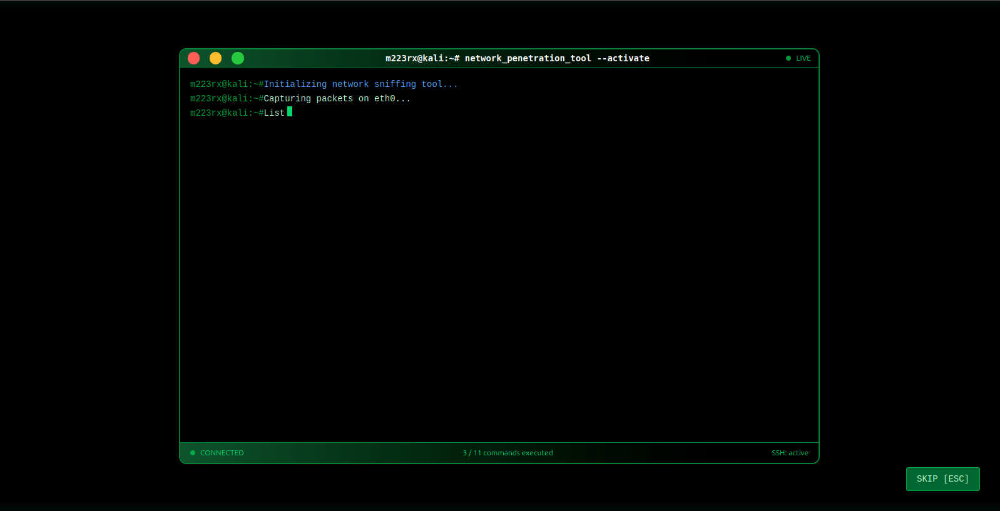

# 🌐 m223rx Hacker-Style Portfolio

Welcome to **m223rx's Hacker-Style Portfolio**, a sleek and immersive web portfolio that combines a **terminal aesthetic** with cinematic animations. This portfolio showcases projects, skills, and creativity in a unique interactive style.

---

## 🚀 Features

- **Cinematic Loading Screen**  
  Simulates a hacker-style network scan with typing animations, package updates, and auto-redirect to the login page.

- **Interactive Terminal**  
  Realistic terminal commands, outputs, and blinking cursor.

- **Skip Animation Option**  
  Users can skip the loading animation with a button or pressing `ESC`.

- **Responsive Design**  
  Fully responsive across desktop and tablet screens.

- **Hacker Aesthetic**  
  Green-on-black theme, animated status bars, and terminal-like UI components.

---

## 🛠 Tech Stack

- **Frontend:**

  - [React.js](https://reactjs.org/) – fast and modern component-based UI
  - [Vite](https://vitejs.dev/) – lightning-fast dev server and build tool
  - [Tailwind CSS](https://tailwindcss.com/) – utility-first styling for rapid design

- **Routing:**

  - [React Router](https://reactrouter.com/) – page navigation and redirects

- **State & Hooks:**

  - `useState`, `useEffect`, `useRef`, `useCallback` – dynamic terminal updates and animations

- **Animations:**
  - Custom typing effects and blinking cursors
  - Progress bars and cinematic delays

---

## 📸 Screenshots

### Loading Screen / Hacker Terminal

### Terminal Output Animation

### Login Page

---

## ⚡ Usage

1. **Clone the repository:**
   git clone https://github.com/yourusername/hacker-portfolio.git
   cd hacker-portfolio

2. **Install dependencies:**
   npm install

3. **Run the development server:**
   npm run dev

4. **Open http://localhost:5173**

## 🎨 Customization

Update the fakeUpdateActions array in LoadingScreen.jsx to modify terminal animation text.
Change theme colors in Tailwind to match your brand.
Add project screenshots and personal info to showcase your work.

## 📂 Project Structure

src/
├── pages/
│ ├── Login.jsx
│ └── Home.jsx
├── App.jsx
├── main.jsx
├── index.css
└── assets/
└── screenshots/

## 💡 Future Enhancements

Full portfolio pages showcasing projects and skills
Interactive terminal commands for navigation
Dynamic dark/light themes
More cinematic “hacker” effects and sound
